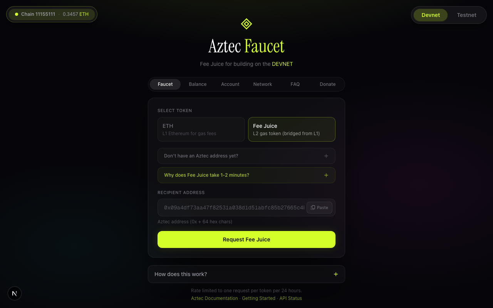
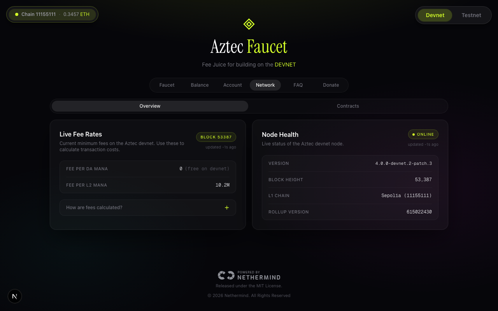
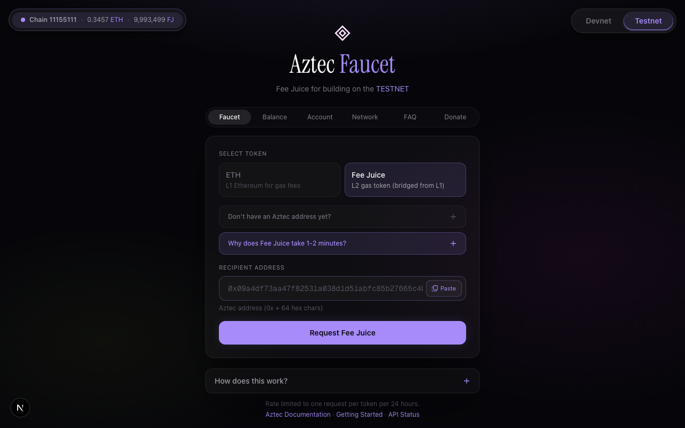
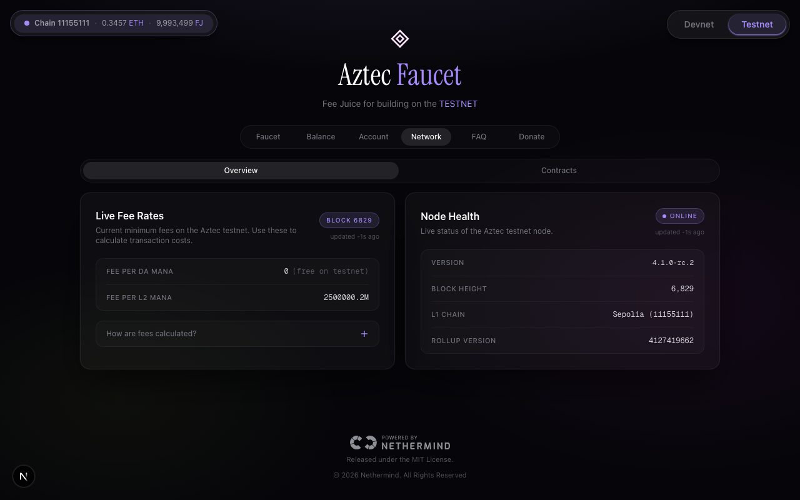
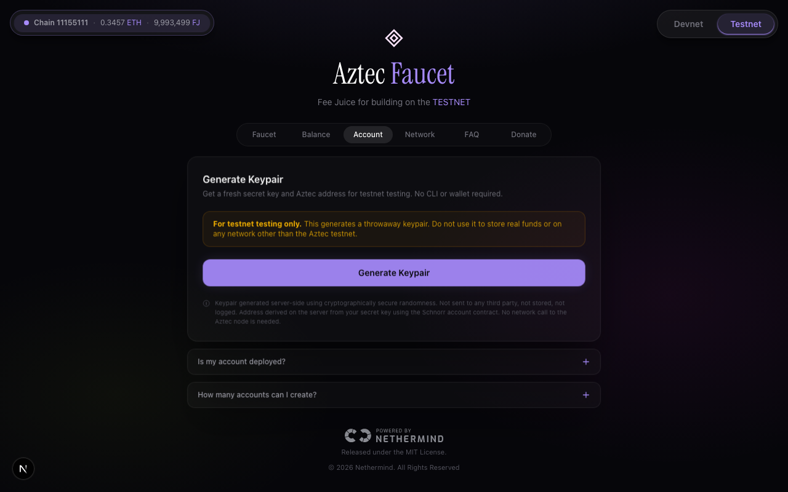
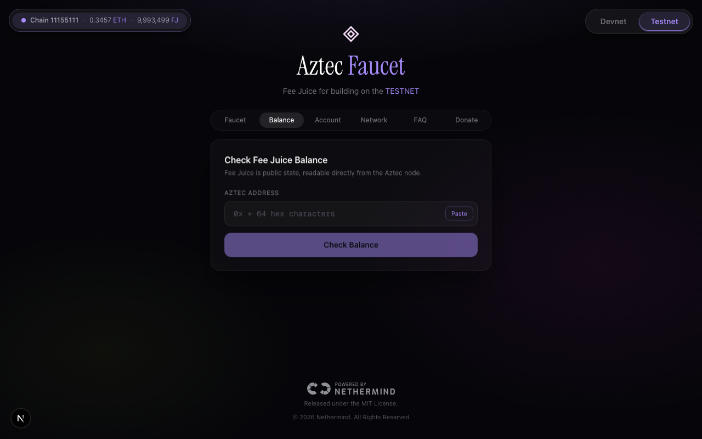

 

<svg xmlns="http://www.w3.org/2000/svg" viewBox="0 0 32 32" fill="none" width="48" height="48">
  <path d="M16 2L28 16L16 30L4 16L16 2Z" stroke="#D4FF28" stroke-width="1.5" fill="#D4FF28" fill-opacity="0.08"/>
  <path d="M16 8L22 16L16 24L10 16L16 8Z" stroke="#D4FF28" stroke-width="1" fill="#D4FF28" fill-opacity="0.15"/>
</svg>

# Aztec Faucet

**Fee Juice and Sepolia ETH for developers building on Aztec.**
Supports both Devnet and Testnet in one place.

---

## The problem

When you move from a local network to devnet or testnet, you immediately hit a wall:

- You need **Fee Juice** to pay for your first transaction.
- Fee Juice can only be claimed after deploying an account.
- Deploying an account requires Fee Juice to pay the fee.

The Aztec Sponsored FPC can cover your very first account deployment, but it gives you nothing for subsequent transactions. This faucet breaks that loop by bridging Fee Juice directly to your address on either network.

---

## Network support

The faucet supports two Aztec networks, selectable from the toggle in the top-right corner of the UI. Switching networks updates every tab: the faucet endpoint, the claim tracker, the balance checker, the node health panel, and all pre-filled CLI commands. The accent colour shifts from chartreuse on Devnet to violet on Testnet, so it is always clear which network is active.

| | Devnet | Testnet |
|--|--|--|
| **L1 Network** | Sepolia (`11155111`) | Sepolia (`11155111`) |
| **Aztec Node** | `v4-devnet-2.aztec-labs.com` | `rpc.testnet.aztec-labs.com` |
| **SDK** | `@aztec/*@devnet` | `@aztec/*@rc` |
| **Sponsored FPC** | `0x09a4df73...caffb2` | `0x19b5539c...56f8f2` |
| **Block Explorer** | [devnet.aztecscan.xyz](https://devnet.aztecscan.xyz) | [testnet.aztecscan.xyz](https://testnet.aztecscan.xyz) |
| **Drip amount** | 1000 Fee Juice | 100 Fee Juice |

### Devnet

### Testnet

---

## What you get

### Fee Juice

Fee Juice is Aztec's native gas token. Unlike ETH, it cannot be minted on L2 directly and must be bridged from L1 through the Fee Juice Portal contract. The faucet handles the full bridge on your behalf: it mints Fee Juice on L1 (on Devnet) or draws from a pre-funded wallet (on Testnet), locks the tokens in the portal, and queues a message for your address. Once the Aztec sequencer includes that message in a block, which takes roughly one to two minutes, the faucet UI shows a live claim tracker with all values pre-filled.

Rate limit: once per 24 hours per address.

### ETH (Sepolia)

This is sent directly to your Ethereum address on Sepolia, and is useful for paying L1 transaction fees and funding your own bridging operations.

Rate limit: 0.001 ETH once per 24 hours per address.

---

## Getting started

Every new Aztec developer faces the same bootstrap problem: you need Fee Juice to deploy an account, but you need an account to claim Fee Juice. The faucet solves this with a three-step flow that works on both Devnet and Testnet.

**Step 1: Get your Aztec address.** Open the **Account** tab and generate a fresh key pair. This gives you a secret key and its corresponding Aztec address. Nothing is deployed and no network call is made. On Aztec, every account address is derived deterministically from the secret key, so the address is known before the contract is ever deployed.

**Step 2: Request Fee Juice.** Open the **Faucet** tab, paste your address, and click Request Fee Juice. The UI immediately shows a Sepolia Etherscan link for the L1 bridge transaction so you can confirm it landed on-chain. The bridge takes roughly one to two minutes.

**Step 3: Claim on L2.** Once the bridge is ready, a Claim section appears in the UI with all values pre-filled. Copy the command and run it in your terminal, substituting only your secret key. The script handles everything else automatically.

### New account: atomic deploy and claim

If your account is not yet deployed, the claim script uses `FeeJuicePaymentMethodWithClaim` to deploy the account contract and claim Fee Juice in a single atomic transaction. The claimed Fee Juice pays the deployment fee itself, so no Sponsored FPC is needed and no pre-existing balance is required. After this one transaction your account is live and fully funded.

### Existing account: direct claim

If you have already deployed your account via the Sponsored FPC or by another means, the script detects that the contract is already on-chain and calls `FeeJuice.claim()` directly into your existing account. The gas for this transaction is paid from whatever balance you already hold.

The Sponsored FPC is a contract on each network that pays transaction fees unconditionally, which solves the very first deployment. However, it gives you no ongoing Fee Juice balance. If you used the Sponsored FPC to deploy and now have zero Fee Juice, request a drip from this faucet and use the direct claim path above.

---

## How the bridge works

When you request Fee Juice, the faucet calls `bridgeTokensPublic()` on the L1 Fee Juice Portal. On Devnet it mints Fee Juice on L1 first, which the devnet build permits. On Testnet the faucet wallet is pre-funded and the mint step is skipped. In both cases the tokens are locked in the portal contract and an L1 to L2 message is queued for your address.

The Aztec sequencer picks up that message and includes it in a block. Once the message is finalised in the L2 Merkle tree, the claim data becomes available. The faucet's claim tracker polls this state continuously and shows the ready indicator as soon as the claim can proceed.

Claim data is kept for 30 minutes. After that the tracker shows "Expired" and you can request a fresh drip.

---

## Shell scripts

The faucet ships network-specific shell scripts that you can pipe directly from GitHub. They handle SDK installation automatically, so you do not need to clone the repository or have any Aztec tooling installed beforehand.

Scripts are organised by network under `sh/devnet/` and `sh/testnet/`, with three scripts per network.

**`create-account.sh`** derives a new Aztec address from a random secret key. Nothing is deployed. The address is computed locally from your key using the Schnorr account contract class, which is the same contract used by `aztec-wallet`. The output is your secret key and address, ready to paste into the Faucet tab.

**`claim.sh`** claims Fee Juice on L2. It accepts the claim values shown in the faucet UI and automatically detects whether your account is deployed. If not deployed, it performs an atomic deploy-and-claim in a single transaction, using the claimed Fee Juice itself to pay the fee. If your account is already deployed, it calls `FeeJuice.claim()` directly.

**`check-balance.sh`** reads the Fee Juice balance of any Aztec address. Fee Juice is stored in public state, so no wallet or private key is needed.

The faucet UI generates the exact commands with all values pre-filled for the selected network. You copy them and run them directly in your terminal.

---

## UI tabs

| Tab | What it does |
|-----|-------------|
| **Faucet** | Request Fee Juice or Sepolia ETH. After a drip, shows a Sepolia Etherscan link for the L1 bridge transaction and a live claim tracker. Once the bridge is ready, displays a pre-filled claim command for the selected network. |
| **Account** | Generate a throwaway Aztec key pair (secret key and address) without any CLI, wallet extension, or account deployment. Keys are generated server-side using cryptographically secure randomness and are never stored or logged. The key pair resets when you switch networks, because devnet and testnet addresses differ for the same secret key. |
| **Balance** | Check the Fee Juice balance of any Aztec address directly from the node. The tab generates a pre-filled terminal command for the selected network. |
| **Network** | Live fee rates, node health (block height, node version, rollup version), and all L1 and L2 protocol contract addresses. Auto-refreshes every 15 seconds and resets on network switch. |
| **FAQ** | Common questions about the bridge, mana, claim expiry, Fee Juice non-transferability, rate limits, and more. |
| **Donate** | Send Sepolia ETH to the faucet wallet to help keep it funded. Shows the faucet wallet address with a copy button and a direct Etherscan link. |

---

## Status bar

A compact status pill in the top-left corner shows the faucet wallet's current L1 ETH balance and, on Testnet, the remaining L1 Fee Juice supply in the pre-funded wallet. It also shows a warning if the running SDK version is behind the latest published npm tag for the selected network. The bar polls every 60 seconds and re-fetches immediately on network switch.

---

[Aztec Documentation](https://docs.aztec.network) · [Getting Started on Devnet](https://docs.aztec.network/developers/getting_started_on_devnet) · [aztec.js SDK](https://docs.aztec.network/developers/docs/aztec-js)

 

Developed by [Giri-Aayush](https://github.com/Giri-Aayush) · A [Nethermind](https://nethermind.io) product · [MIT License](./LICENSE)

