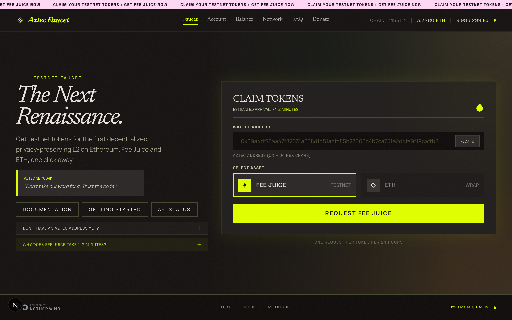
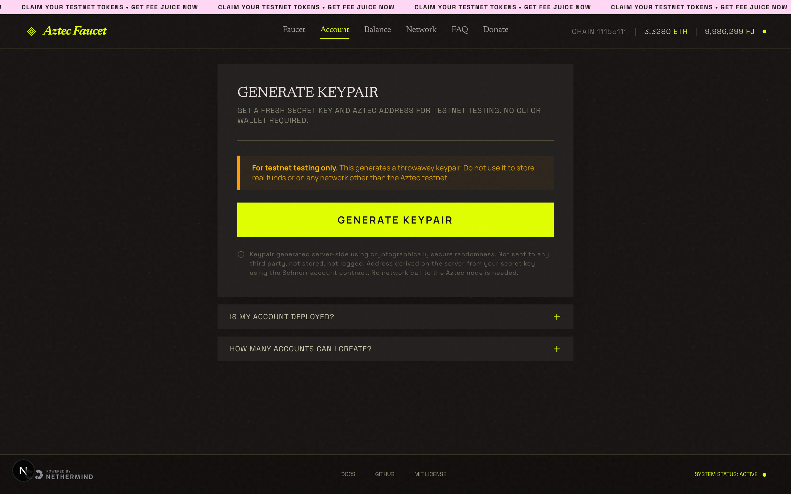
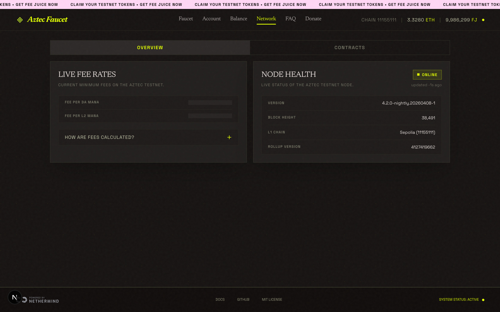
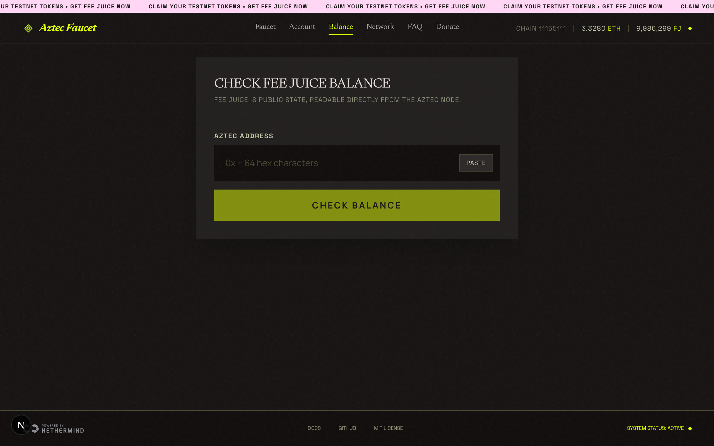

 

<svg xmlns="http://www.w3.org/2000/svg" viewBox="0 0 32 32" fill="none" width="48" height="48">
  <path d="M16 2L28 16L16 30L4 16L16 2Z" stroke="#D4FF28" stroke-width="1.5" fill="#D4FF28" fill-opacity="0.08"/>
  <path d="M16 8L22 16L16 24L10 16L16 8Z" stroke="#D4FF28" stroke-width="1" fill="#D4FF28" fill-opacity="0.15"/>
</svg>

# Aztec Faucet

**Fee Juice and Sepolia ETH for developers building on Aztec Testnet.**

  

---

## The problem

When you move from a local network to the Aztec Testnet, you immediately hit a wall:

- You need **Fee Juice** to pay for your first transaction.
- Fee Juice must be **bridged from L1**, not minted on L2.
- Bridging requires an L1 transaction and waiting for the L2 sequencer.

The Sponsored FPC can cover your very first account deployment, but gives you nothing for subsequent transactions. This faucet breaks that loop: it bridges Fee Juice from a pre-funded Sepolia wallet directly to your address and handles the atomic deploy-and-claim in one step.

---

## Screenshots

| Faucet | Account |
|--------|---------|
|  |  |

| Network | Balance |
|---------|---------|
|  |  |

---

## Network

The faucet targets a single network: **Aztec Testnet**.

| | Testnet |
|--|--|
| **L1 Network** | Sepolia (`11155111`) |
| **Aztec Node** | `rpc.testnet.aztec-labs.com` |
| **SDK** | `@aztec/*` (`4.1.2-rc.1`) |
| **Block Explorer** | [testnet.aztecscan.xyz](https://testnet.aztecscan.xyz) |
| **Drip amount** | 100 Fee Juice |

All network configuration is centralized in `src/lib/network-config.ts`.

---

## What you get

### Fee Juice

Fee Juice is Aztec's native gas token. It cannot be minted on L2 directly and must be bridged from L1 through the FeeJuicePortal contract. The faucet handles the full bridge on your behalf: it draws from a pre-funded wallet on Sepolia, locks the tokens in the portal, and queues a message for your address. Once the Aztec sequencer includes that message in a block (roughly 1-2 minutes), the faucet UI shows a live claim tracker with all values pre-filled.

Rate limit: one request per 24 hours per address (production).

### ETH (Sepolia)

Sent directly to your Ethereum address on Sepolia. Useful for paying L1 transaction fees and funding your own bridging operations.

Rate limit: 0.001 ETH, one request per 24 hours per address (production).

---

## Getting started

Every new Aztec developer faces the same bootstrap problem: you need Fee Juice to deploy an account, but you need an account to claim Fee Juice. The faucet solves this in three steps.

**Step 1: Get your Aztec address.** Open the **Account** tab and generate a fresh keypair. This gives you a secret key and its corresponding Aztec address. Nothing is deployed and no network call is made. On Aztec, every account address is derived deterministically from the secret key, so the address is known before the contract is ever deployed.

**Step 2: Request Fee Juice.** Open the **Faucet** tab, paste your address, and click Request Fee Juice. The UI immediately shows a Sepolia Etherscan link for the L1 bridge transaction so you can confirm it landed on-chain. The bridge takes roughly 1-2 minutes.

**Step 3: Claim on L2.** Once the bridge is ready, a Claim section appears in the UI with all values pre-filled. Copy the command and run it in your terminal, substituting only your secret key. The script handles everything else automatically.

### New account: atomic deploy and claim

If your account is not yet deployed, the claim script uses `FeeJuicePaymentMethodWithClaim` to deploy the account contract and claim Fee Juice in a single atomic transaction. The claimed Fee Juice pays the deployment fee itself, so no Sponsored FPC is needed and no pre-existing balance is required. After this one transaction your account is live and fully funded.

### Existing account: direct claim

If you have already deployed your account via the Sponsored FPC or by another means, the script detects that the contract is already on-chain and calls `FeeJuice.claim()` directly into your existing account. The gas for this transaction is paid from whatever balance you already hold.

---

## How the bridge works

When you request Fee Juice, the faucet calls `bridgeTokensPublic()` on the L1 FeeJuicePortal. The faucet wallet is pre-funded on Sepolia. The tokens are locked in the portal contract and an L1-to-L2 message is queued for your address.

The Aztec sequencer picks up that message and includes it in a block. Once the message is finalized in the L2 Merkle tree, the claim data becomes available. The faucet's claim tracker polls this state continuously and shows the ready indicator as soon as the claim can proceed.

Claim data is kept for 30 minutes. After that the tracker shows "Expired" and you can request a fresh drip.

---

## Shell scripts

The faucet ships shell scripts under `sh/testnet/` that you can pipe directly from GitHub. They handle SDK installation automatically, so you do not need to clone the repository or have any Aztec tooling installed beforehand.

**`create-account.sh`** derives a new Aztec address from a random secret key. Nothing is deployed. The address is computed locally from your key using the Schnorr account contract class, which is the same contract used by `aztec-wallet`.

**`claim.sh`** claims Fee Juice on L2. It accepts the claim values shown in the faucet UI and automatically detects whether your account is deployed. If not deployed, it performs an atomic deploy-and-claim in a single transaction. If already deployed, it calls `FeeJuice.claim()` directly.

**`check-balance.sh`** reads the Fee Juice balance of any Aztec address. Fee Juice is stored in public state, so no wallet or private key is needed.

The faucet UI generates the exact commands with all values pre-filled. You copy them and run them directly in your terminal.

---

## UI tabs

| Tab | What it does |
|-----|-------------|
| **Faucet** | Request Fee Juice or Sepolia ETH. After a drip, shows a Sepolia Etherscan link for the L1 bridge transaction and a live claim tracker. Once the bridge is ready, displays a pre-filled claim command. |
| **Account** | Generate a throwaway Aztec keypair (secret key and address) without any CLI, wallet extension, or account deployment. Keys are generated server-side using cryptographically secure randomness and are never stored or logged. |
| **Balance** | Check the Fee Juice balance of any Aztec address directly from the node. Generates a pre-filled terminal command. |
| **Network** | Live fee rates, node health (block height, node version, rollup version), and all L1/L2 protocol contract addresses. Auto-refreshes every 15 seconds. |
| **FAQ** | Common questions about the bridge, mana, claim expiry, Fee Juice non-transferability, rate limits, and more. |
| **Donate** | Send Sepolia ETH to the faucet wallet to help keep it funded. Shows the faucet wallet address with a copy button and a direct Etherscan link. |

---

## Status bar

A compact status indicator in the navigation bar shows the faucet wallet's current L1 ETH balance and the remaining L1 Fee Juice supply. It also displays the active chain and polls every 60 seconds.

---

## Docker

The production image uses **Ubuntu 24.04** as the base image (not `node:24-slim`) because `@aztec/bb.js` ships a native binary that requires GLIBC 2.39. The Dockerfile installs Node.js 24 on top of Ubuntu and uses npm 10 for compatibility with lockfileVersion 3.

---

[Aztec Documentation](https://docs.aztec.network) · [Getting Started](https://docs.aztec.network/guides/getting_started) · [aztec.js SDK](https://docs.aztec.network/guides/developer_guides/js_apps/aztec-js)

 

Developed by [Giri-Aayush](https://github.com/Giri-Aayush) · A [Nethermind](https://nethermind.io) product · [MIT License](./LICENSE)

